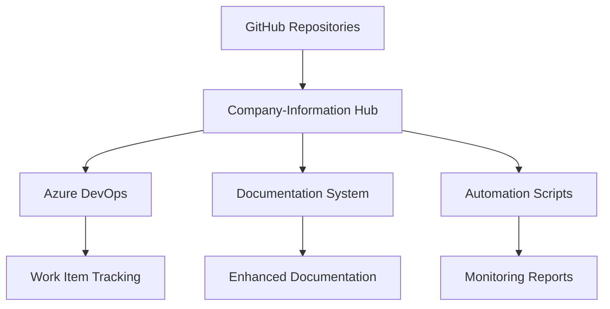

# AI-Whisperers Company-Information Project Structure

**Organization:** AI-Whisperers  
**Repository:** Company-Information  
**Purpose:** Central organizational hub and automation system  
**Last Updated:** January 13, 2025

---

## 📁 Complete Project Structure

```
Company-Information/
├── 📋 Core Documentation
│   ├── README.md                           # Main project overview
│   ├── DOCUMENTATION_MASTER_INDEX.md      # Central documentation hub
│   ├── CLAUDE.md                           # Claude AI integration guide
│   ├── TODO.md                             # Project todos
│   ├── BEST_PRACTICES.md                   # Development best practices
│   ├── TROUBLESHOOTING.md                  # Common issues and solutions
│   ├── NEW_TEAM_MEMBER_ONBOARDING.md      # Team onboarding guide
│   ├── DEPLOYMENT_SUMMARY.md              # Deployment procedures
│   ├── EXCALIBUR-COMMAND.md               # Advanced command system
│   └── SYSTEM_INTEGRATION_TEST.md         # Integration testing guide
│
├── 📚 Documentation System
│   ├── documentation-templates/           # Standardized templates
│   │   ├── README_TEMPLATE.md             # Repository README template
│   │   ├── CONTRIBUTING_TEMPLATE.md       # Contributor guidelines template
│   │   ├── ARCHITECTURE_TEMPLATE.md       # System architecture template
│   │   ├── API_TEMPLATE.md                # API documentation template
│   │   └── DOCUMENTATION_STANDARDS.md     # Quality standards and guidelines
│   │
│   └── enhanced-documentation/            # Enhanced README files for all repos
│       ├── AI-Investment-ENHANCED-README.md
│       ├── AI-Whisperers-Core-ENHANCED-README.md
│       ├── AI-Whisperers-website-and-courses-ENHANCED-README.md
│       ├── AI-Whisperers-Website-ENHANCED-README.md
│       ├── Call-Recorder-ENHANCED-README.md
│       ├── clockify-ADO-automated-report-ENHANCED-README.md
│       ├── Comment-Analyzer-ENHANCED-README.md
│       ├── Company-Information-ENHANCED-README.md
│       └── WPG-Amenities-ENHANCED-README.md
│
├── ☁️ Azure DevOps Integration
│   ├── azure-devops/                      # Azure DevOps configuration
│   │   ├── azure-cli-import.ps1           # Azure CLI import script
│   │   ├── azure-devops-config.json       # Configuration settings
│   │   ├── azure-devops-migration-plan.md # Migration planning
│   │   ├── BACKLOG_AND_KANBAN_SETUP_GUIDE.md # Setup guide
│   │   ├── backlog-import.csv             # Backlog import data
│   │   └── import-backlog-now.ps1         # Backlog import script
│   │
│   ├── azure-pipelines/                   # CI/CD pipeline configurations
│   │   ├── core-services.yml              # Core services pipeline
│   │   ├── ml-models.yml                  # ML models pipeline
│   │   └── web-platform.yml               # Web platform pipeline
│   │
│   ├── azure-pipelines.yml                # Main pipeline configuration
│   ├── AZURE_AUDIT_UPGRADE_TODO.md        # Azure audit tasks
│   └── AZURE_TASKS_VALIDATION_SUMMARY.md  # Task validation summary
│
├── 📋 Work Items Management
│   └── azure-work-items/                  # File-based work item management
│       ├── _scripts/                      # Automation scripts
│       │   ├── create-all-stories.js      # Story creation script
│       │   ├── import-to-azure.js         # Azure import script
│       │   └── package.json               # Node.js dependencies
│       │
│       ├── _templates/                    # Work item templates
│       │   ├── epic-template.md           # Epic template
│       │   ├── feature-template.md        # Feature template
│       │   └── story-template.md          # User story template
│       │
│       ├── Business-Setup/                # Main business project (586 story points)
│       │   ├── EPIC-001-Foundation/       # Business foundation
│       │   │   ├── Features/
│       │   │   │   ├── FEATURE-001-Legal-Structure.md
│       │   │   │   └── FEATURE-002-Financial-Systems.md
│       │   │   └── Stories/               # 8 user stories
│       │   ├── EPIC-002-Web-Presence/     # Web presence
│       │   │   ├── Features/
│       │   │   │   ├── FEATURE-003-Website-Development.md
│       │   │   │   └── FEATURE-004-Brand-Identity.md
│       │   │   └── Stories/               # 10 user stories
│       │   ├── EPIC-003-Operations/       # Operations setup
│       │   ├── EPIC-004-Development/      # Development infrastructure
│       │   ├── EPIC-005-Growth/           # Growth strategies
│       │   └── SPRINT_PLANNING.md         # Sprint planning guide
│       │
│       ├── AI-Investment/                 # AI Investment platform project
│       │   ├── Epics/
│       │   │   └── EPIC-201-Data-Infrastructure.md
│       │   └── PROJECT_OVERVIEW.md
│       │
│       ├── Business-Website/              # Business website project
│       │   ├── Epics/
│       │   │   └── EPIC-101-Design-UX.md
│       │   └── PROJECT_OVERVIEW.md
│       │
│       ├── Comment-Analyzer/              # Comment analyzer project
│       │   ├── Epics/
│       │   │   └── EPIC-501-ML-Pipeline.md
│       │   └── PROJECT_OVERVIEW.md
│       │
│       ├── WPG-Amenities/                 # WPG amenities project
│       │   ├── Epics/
│       │   │   └── EPIC-401-Architecture.md
│       │   └── PROJECT_OVERVIEW.md
│       │
│       ├── WPG-Page/                      # WPG page project
│       │   └── PROJECT_OVERVIEW.md
│       │
│       ├── ALL_PROJECTS_OVERVIEW.md       # Portfolio overview
│       ├── DASHBOARD.md                   # Project dashboard
│       ├── QUICK_START.md                 # Quick start guide
│       ├── README.md                      # Work items documentation
│       └── WORK_ITEMS_STRUCTURE.md        # Structure documentation
│
├── 🔧 Automation Scripts
│   └── scripts/                           # PowerShell automation scripts
│       ├── Repository Management/
│       │   ├── github-commit-tracker.ps1  # GitHub commit tracking
│       │   ├── new-repo-monitor.ps1       # New repository monitoring
│       │   ├── simple-commit-tracker.ps1  # Simple commit tracking
│       │   └── repo-monitor-dashboard.ps1 # Repository dashboard
│       │
│       ├── Azure Integration/
│       │   ├── azure-devops-sync.ps1      # Azure DevOps synchronization
│       │   └── azure-sync-logs/           # Sync logs directory
│       │
│       ├── File Management/
│       │   ├── file-sync.ps1              # Basic file synchronization
│       │   ├── file-sync-advanced.ps1     # Advanced file sync
│       │   ├── file-sync-manager.ps1      # File sync management
│       │   └── sync-logs/                 # File sync logs
│       │
│       ├── Project Management/
│       │   ├── dashboard.ps1              # Project dashboard
│       │   ├── manage-todos.ps1           # TODO management
│       │   ├── todo-manager.ps1           # Advanced TODO management
│       │   ├── management-summary.ps1     # Management reporting
│       │   └── todo-reports/              # TODO reports directory
│       │
│       ├── Monitoring & Reporting/
│       │   ├── monitoring-system/         # Monitoring system
│       │   │   ├── daily-monitoring.ps1   # Daily monitoring script
│       │   │   ├── monitoring-config.json # Monitoring configuration
│       │   │   └── run-monitoring.bat     # Monitoring runner
│       │   ├── monitoring-logs/           # Monitoring logs
│       │   ├── monitoring-reports/        # Monitoring reports
│       │   ├── deploy-monitoring.ps1      # Deployment monitoring
│       │   └── weekly-activity-report.ps1 # Weekly activity reports
│       │
│       ├── Dependency Management/
│       │   ├── dependency-tracker.ps1     # Dependency tracking
│       │   └── dependency-reports/        # Dependency reports
│       │
│       ├── Release Management/
│       │   ├── release-coordinator.ps1    # Release coordination
│       │   └── release-reports/           # Release reports
│       │       └── release-checklist-v1.0.0-2025-09-09-1350.md
│       │
│       ├── excalibur-command.ps1          # Advanced command system
│       └── README.md                      # Scripts documentation
│
├── 🔌 MCP Integration
│   ├── mcp-servers/                       # MCP server configurations
│   │   ├── setup-mcp.js                   # MCP setup script
│   │   ├── load-env-to-mcp.js            # Environment loader
│   │   ├── test-connections.js            # Connection testing
│   │   ├── INSTALLED_MCP_SERVERS.md       # Server documentation
│   │   ├── package.json                   # Node.js dependencies
│   │   └── package-lock.json              # Dependency lock file
│   │
│   ├── mcp-tools/                         # MCP tools and utilities
│   │   ├── MCP_INTEGRATIONS_GUIDE.md      # Integration guide
│   │   └── README.md                      # Tools documentation
│   │
│   ├── mcp-config.json                    # MCP configuration
│   └── mcp-config-full.json               # Full MCP configuration
│
├── 📋 Project Management
│   └── project-todos/                     # Project-specific TODO lists
│       ├── ai-investment-todos.md         # AI Investment todos
│       ├── ai-whisperers-todos.md         # Core AI Whisperers todos
│       ├── ai-whisperers-website-and-courses-todos.md
│       ├── ai-whisperers-website-todos.md # Website todos
│       ├── call-recorder-todos.md         # Call recorder todos
│       ├── clockify-ado-automated-report-todos.md
│       ├── comment-analizer-todos.md      # Comment analyzer todos
│       ├── company-information-todos.md   # Company info todos
│       ├── taller-ocampos-todos.md        # Taller Ocampos todos
│       ├── wpg-amenities-todos.md         # WPG amenities todos
│       ├── excalibur-summary-20250909-155355.md # Excalibur summary
│       └── repository-analysis-summary.md # Repository analysis
│
├── ⚙️ Setup & Configuration
│   ├── setup-scripts/                     # Initial setup scripts
│   │   ├── install-azure-cli.bat          # Azure CLI installation
│   │   └── setup-aws-terraform.ps1        # AWS Terraform setup
│   │
│   └── sync-config.json                   # Synchronization configuration
│
└── 📊 Logs & Reports
    └── logs/                              # System logs
        ├── excalibur-20250909-155107.log  # Excalibur logs
        └── excalibur-20250909-155251.log
```

---

## 🏗️ Architecture Overview

### **Core Components**

| Component | Purpose | Key Files |
|-----------|---------|-----------|
| **Documentation Hub** | Centralized documentation management | `DOCUMENTATION_MASTER_INDEX.md`, templates/ |
| **Work Items System** | Azure DevOps work item management | `azure-work-items/` |
| **Automation Engine** | PowerShell automation scripts | `scripts/` |
| **Azure Integration** | DevOps and pipeline integration | `azure-devops/`, `azure-pipelines/` |
| **MCP Integration** | Model Context Protocol integration | `mcp-servers/`, `mcp-tools/` |
| **Project Management** | TODO and project tracking | `project-todos/` |

### **Data Flow**



---

## 📊 Project Statistics

### **File Distribution**
- **Total Directories:** 25+
- **PowerShell Scripts:** 15+
- **Documentation Files:** 50+
- **Configuration Files:** 10+
- **Work Items:** 60+ (Business Setup alone)

### **Project Coverage**
- **Repositories Managed:** 9
- **Active Projects:** 6
- **Story Points:** 586
- **Budget Range:** $120K - $220K

### **Automation Capabilities**
- **Repository Monitoring:** Real-time health checks
- **Documentation Sync:** Cross-repository standardization
- **Work Item Management:** Azure DevOps integration
- **Reporting:** Automated weekly/daily reports
- **Deployment:** CI/CD pipeline automation

---

## 🎯 Key Features

### **1. Multi-Repository Management**
- Centralized oversight of 9 repositories
- Standardized documentation across all projects
- Automated health monitoring and reporting

### **2. Azure DevOps Integration**
- File-based work item management
- Automated import/export capabilities
- Sprint planning and project tracking

### **3. Documentation Automation**
- Template-based documentation system
- Quality standards enforcement
- Enhanced README generation for all repos

### **4. PowerShell Automation Suite**
- Repository health monitoring
- File synchronization
- Dependency tracking
- Release coordination

### **5. MCP Integration**
- Model Context Protocol server setup
- AI tool integration capabilities
- Advanced automation features

---

## 🚀 Getting Started

### **Quick Navigation**
1. **Project Overview:** `README.md`
2. **Documentation Hub:** `DOCUMENTATION_MASTER_INDEX.md`
3. **Work Items:** `azure-work-items/README.md`
4. **Automation:** `scripts/README.md`
5. **Team Onboarding:** `NEW_TEAM_MEMBER_ONBOARDING.md`

### **Key Entry Points**
- **For Developers:** `documentation-templates/`
- **For Project Managers:** `azure-work-items/`
- **For DevOps:** `azure-devops/`, `scripts/`
- **For Documentation:** `DOCUMENTATION_MASTER_INDEX.md`

---

## 📞 Support

### **Documentation Questions**
- Review `documentation-templates/DOCUMENTATION_STANDARDS.md`
- Check `enhanced-documentation/` for examples

### **Technical Issues**
- Consult `TROUBLESHOOTING.md`
- Review relevant script documentation in `scripts/`

### **Project Management**
- Use `azure-work-items/` for work item management
- Check `project-todos/` for project-specific tasks

---

**Last Updated:** January 13, 2025  
**Maintained by:** AI-Whisperers Team  
**Repository:** [Company-Information](https://github.com/Ai-Whisperers/Company-Information)
