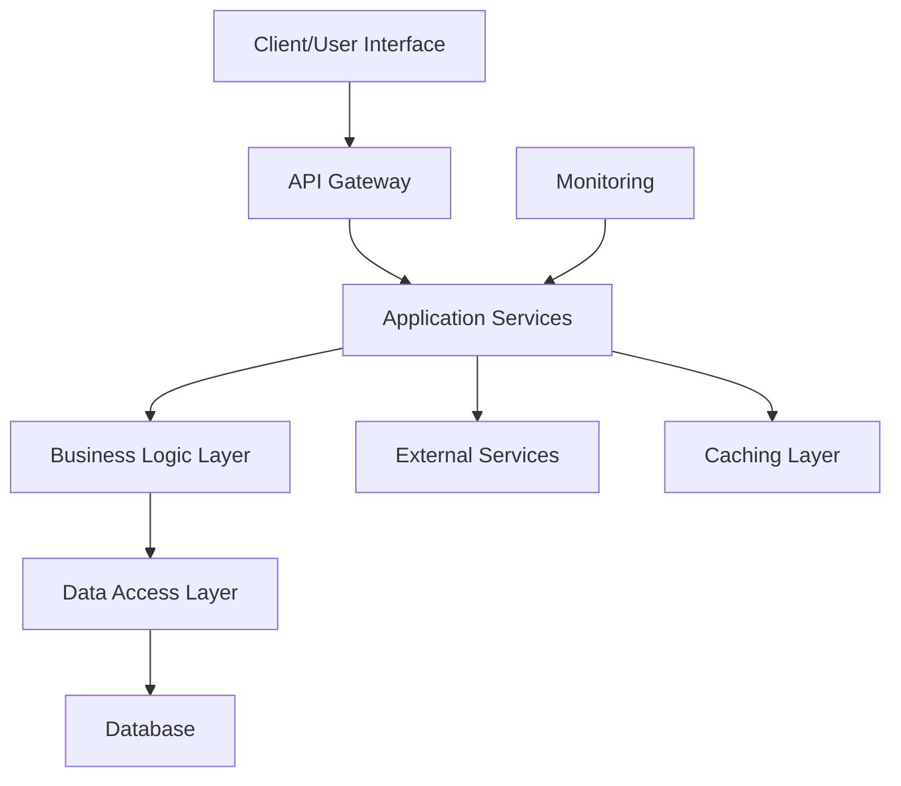
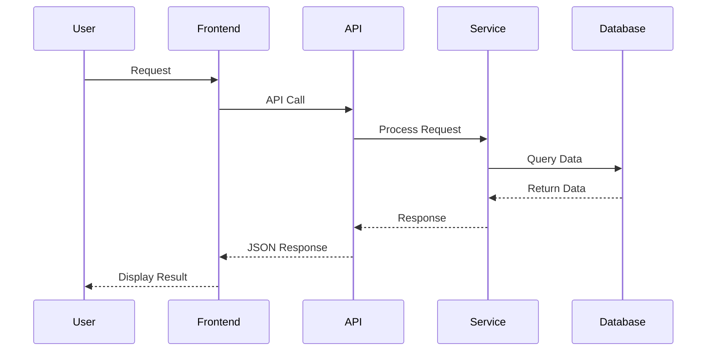
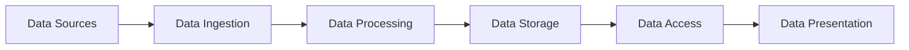
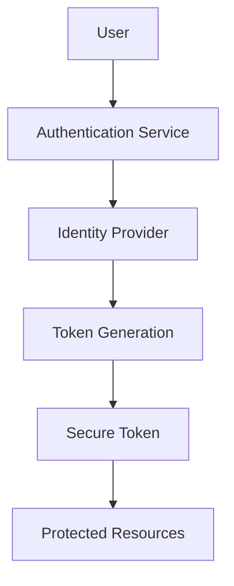
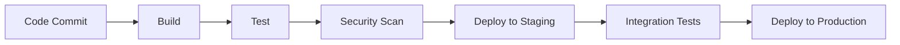

# [Project Name] - System Architecture

**Version:** 1.0  
**Last Updated:** [Date]  
**Maintained By:** [AI-Whisperers Team](https://github.com/Ai-Whisperers)

## 📋 Table of Contents

- [Overview](#overview)
- [System Architecture](#system-architecture)
- [Component Architecture](#component-architecture)
- [Data Architecture](#data-architecture)
- [Security Architecture](#security-architecture)
- [Deployment Architecture](#deployment-architecture)
- [Performance & Scalability](#performance--scalability)
- [Technology Stack](#technology-stack)
- [Architecture Decisions](#architecture-decisions)
- [Future Considerations](#future-considerations)

---

## 🎯 Overview

### Purpose
[Brief description of what this document covers and its intended audience]

### Scope
[Define the scope of the architectural documentation - what is and isn't covered]

### Stakeholders
- **Developers** - Understanding system structure and components
- **DevOps Teams** - Deployment and infrastructure management
- **Architects** - System design decisions and evolution
- **Security Teams** - Security considerations and compliance
- **Business Stakeholders** - High-level system capabilities

---

## 🏗️ System Architecture

### High-Level Architecture
[Provide a high-level architectural diagram and description]



### Architectural Style
**Pattern:** [e.g., Microservices, Monolith, Layered, Event-Driven, etc.]

**Rationale:** [Explain why this architectural pattern was chosen]

### Key Architectural Principles
1. **[Principle 1]** - [Description and rationale]
2. **[Principle 2]** - [Description and rationale]
3. **[Principle 3]** - [Description and rationale]
4. **[Principle 4]** - [Description and rationale]

### System Context
[Describe how this system fits into the broader organizational ecosystem]

#### External Systems Integration
- **[External System 1]** - [Integration method and purpose]
- **[External System 2]** - [Integration method and purpose]
- **[External System 3]** - [Integration method and purpose]

---

## 🧩 Component Architecture

### Core Components

#### [Component 1 Name]
**Purpose:** [What this component does]  
**Technology:** [Technology stack used]  
**Responsibilities:**
- [Responsibility 1]
- [Responsibility 2]
- [Responsibility 3]

**Interfaces:**
- **Input:** [Data/requests received]
- **Output:** [Data/responses provided]
- **Dependencies:** [Other components it depends on]

#### [Component 2 Name]
**Purpose:** [What this component does]  
**Technology:** [Technology stack used]  
**Responsibilities:**
- [Responsibility 1]
- [Responsibility 2]
- [Responsibility 3]

#### [Component 3 Name]
[Continue for all major components]

### Component Interaction Diagram


### Component Dependencies
[Diagram or description of how components depend on each other]

---

## 💾 Data Architecture

### Data Flow Overview
[Describe how data flows through the system]



### Database Design

#### Primary Database
**Type:** [e.g., PostgreSQL, MongoDB, etc.]  
**Purpose:** [Primary data storage for operational data]

**Key Entities:**
- **[Entity 1]** - [Description and key attributes]
- **[Entity 2]** - [Description and key attributes]
- **[Entity 3]** - [Description and key attributes]

#### Caching Strategy
**Technology:** [e.g., Redis, Memcached, etc.]  
**Purpose:** [Performance optimization, session storage, etc.]

**Caching Patterns:**
- **Cache-Aside** - [Where and why used]
- **Write-Through** - [Where and why used]
- **Write-Behind** - [Where and why used]

#### Data Storage Patterns
- **Primary Storage:** [Main operational data storage approach]
- **Backup Strategy:** [Backup and recovery approach]
- **Archival:** [Long-term data retention strategy]

### Data Security
- **Encryption at Rest** - [Implementation details]
- **Encryption in Transit** - [Implementation details]
- **Access Control** - [Data access control mechanisms]
- **Audit Logging** - [Data access audit trail]

---

## 🔒 Security Architecture

### Security Model
[Overall security approach and philosophy]

### Authentication & Authorization

#### Authentication
**Method:** [e.g., JWT, OAuth, Session-based, etc.]  
**Implementation:** [Technical implementation details]



#### Authorization
**Model:** [e.g., RBAC, ABAC, etc.]  
**Implementation:** [How permissions are managed and enforced]

### Security Controls

#### Network Security
- **Firewall Configuration** - [Network access controls]
- **API Gateway Security** - [Rate limiting, DDoS protection]
- **VPN/Private Networks** - [Network isolation strategies]

#### Application Security
- **Input Validation** - [Data validation and sanitization]
- **Output Encoding** - [XSS and injection prevention]
- **Session Management** - [Secure session handling]
- **Error Handling** - [Secure error responses]

#### Data Security
- **Data Classification** - [Data sensitivity levels]
- **Encryption Standards** - [Encryption algorithms and key management]
- **Data Masking** - [PII protection strategies]
- **Backup Security** - [Secure backup procedures]

### Compliance Requirements
[Any regulatory or compliance requirements that affect architecture]

---

## 🚀 Deployment Architecture

### Infrastructure Overview
[High-level infrastructure design]

### Deployment Environments

#### Development Environment
**Purpose:** [Development and initial testing]  
**Infrastructure:** [Development infrastructure details]  
**Configuration:** [Environment-specific configurations]

#### Staging/Testing Environment
**Purpose:** [Pre-production testing and validation]  
**Infrastructure:** [Staging infrastructure details]  
**Configuration:** [Environment-specific configurations]

#### Production Environment
**Purpose:** [Live system serving end users]  
**Infrastructure:** [Production infrastructure details]  
**Configuration:** [Environment-specific configurations]

### Container Strategy (if applicable)
**Technology:** [e.g., Docker, Kubernetes]  
**Orchestration:** [Container orchestration approach]

```yaml
# Example container architecture
apiVersion: apps/v1
kind: Deployment
metadata:
  name: [app-name]
spec:
  replicas: 3
  selector:
    matchLabels:
      app: [app-name]
  template:
    metadata:
      labels:
        app: [app-name]
    spec:
      containers:
      - name: [container-name]
        image: [image-name]
        ports:
        - containerPort: [port]
```

### CI/CD Pipeline
[Description of continuous integration and deployment process]



---

## ⚡ Performance & Scalability

### Performance Requirements
- **Response Time:** [Target response times]
- **Throughput:** [Expected request volume]
- **Concurrent Users:** [Maximum concurrent user load]
- **Availability:** [Uptime requirements]

### Scalability Strategy

#### Horizontal Scaling
[How the system scales by adding more instances]

#### Vertical Scaling
[How the system scales by increasing resource capacity]

#### Database Scaling
- **Read Replicas** - [Read scaling strategy]
- **Sharding** - [Data partitioning approach]
- **Connection Pooling** - [Database connection optimization]

### Performance Optimization Techniques
- **Caching** - [Caching strategies and implementation]
- **CDN** - [Content delivery network usage]
- **Compression** - [Data compression techniques]
- **Lazy Loading** - [On-demand resource loading]

### Monitoring & Observability
- **Application Monitoring** - [Application performance monitoring]
- **Infrastructure Monitoring** - [System resource monitoring]
- **Logging Strategy** - [Centralized logging approach]
- **Alerting** - [Alert rules and notification strategies]

---

## 🛠️ Technology Stack

### Frontend Technologies
| Component | Technology | Version | Rationale |
|-----------|------------|---------|-----------|
| [Component 1] | [Technology] | [Version] | [Why chosen] |
| [Component 2] | [Technology] | [Version] | [Why chosen] |

### Backend Technologies
| Component | Technology | Version | Rationale |
|-----------|------------|---------|-----------|
| [Component 1] | [Technology] | [Version] | [Why chosen] |
| [Component 2] | [Technology] | [Version] | [Why chosen] |

### Database Technologies
| Component | Technology | Version | Rationale |
|-----------|------------|---------|-----------|
| [Component 1] | [Technology] | [Version] | [Why chosen] |
| [Component 2] | [Technology] | [Version] | [Why chosen] |

### Infrastructure Technologies
| Component | Technology | Version | Rationale |
|-----------|------------|---------|-----------|
| [Component 1] | [Technology] | [Version] | [Why chosen] |
| [Component 2] | [Technology] | [Version] | [Why chosen] |

### Development & Operations
| Tool Category | Technology | Purpose |
|---------------|------------|---------|
| Version Control | [Tool] | [Purpose] |
| CI/CD | [Tool] | [Purpose] |
| Monitoring | [Tool] | [Purpose] |
| Testing | [Tool] | [Purpose] |

---

## 📝 Architecture Decisions

### Decision Records

#### ADR-001: [Architecture Decision Title]
**Date:** [Decision Date]  
**Status:** [Accepted/Superseded/Deprecated]

**Context:** [The architectural issue motivating this decision]

**Decision:** [The architectural decision that was made]

**Rationale:** [Why this decision was made]

**Consequences:** [Positive and negative consequences of this decision]

#### ADR-002: [Another Architecture Decision]
[Follow same format for additional decisions]

### Trade-offs Analysis

#### [Trade-off 1: e.g., Consistency vs. Availability]
**Decision:** [What was chosen]  
**Rationale:** [Why this trade-off was made]  
**Impact:** [What this means for the system]

#### [Trade-off 2: e.g., Performance vs. Security]
**Decision:** [What was chosen]  
**Rationale:** [Why this trade-off was made]  
**Impact:** [What this means for the system]

---

## 🔮 Future Considerations

### Planned Enhancements
- **[Enhancement 1]** - [Description and timeline]
- **[Enhancement 2]** - [Description and timeline]
- **[Enhancement 3]** - [Description and timeline]

### Technology Evolution
- **Emerging Technologies** - [Technologies being evaluated]
- **Migration Plans** - [Planned technology upgrades or migrations]
- **Deprecation Timeline** - [Technologies being phased out]

### Scalability Roadmap
- **Short-term (6 months)** - [Immediate scalability improvements]
- **Medium-term (1-2 years)** - [Planned architecture evolution]
- **Long-term (2+ years)** - [Strategic architectural changes]

### Risk Management
- **Technical Risks** - [Identified technical risks and mitigation strategies]
- **Operational Risks** - [Operational risks and contingency plans]
- **Security Risks** - [Security risks and prevention measures]

---

## 📚 References and Resources

### Internal Documentation
- [Project README](../README.md) - [Description]
- [API Documentation](../API.md) - [Description]
- [Deployment Guide](../DEPLOYMENT.md) - [Description]

### External Resources
- [Technology Documentation](link) - [Description]
- [Best Practices Guide](link) - [Description]
- [Industry Standards](link) - [Description]

### Architecture Tools
- **Diagramming:** [Tools used for architectural diagrams]
- **Modeling:** [Tools used for architectural modeling]
- **Documentation:** [Tools used for maintaining this documentation]

---

## 📞 Contacts and Support

### Architecture Team
- **Lead Architect:** [Name](mailto:email)
- **Security Architect:** [Name](mailto:email)
- **Infrastructure Architect:** [Name](mailto:email)

### Review and Approval
- **Technical Review:** [Review process and schedule]
- **Security Review:** [Security review requirements]
- **Stakeholder Approval:** [Approval process for architectural changes]

---

**Document History:**
- **v1.0** - [Date] - Initial architecture documentation
- **[Next version]** - [Date] - [Description of changes]

**Next Review Date:** [Date]  
**Approved By:** [Approver Name and Title]  
**Last Updated:** [Date]

---

*This document is maintained as part of the [Project Name] technical documentation suite and should be updated whenever significant architectural changes are made.*