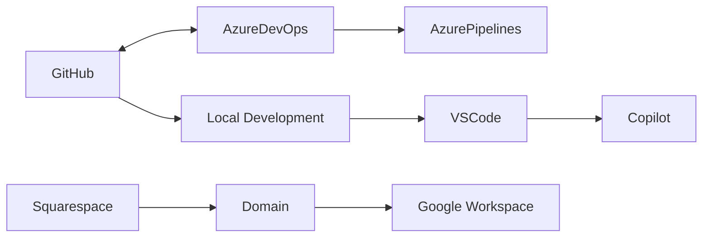

# Current Platforms & Services

**Last Updated**: 2025-08-13  
**Organization**: AI-Whisperers

---

## 🔧 Active Platforms Overview

We currently utilize eight primary platforms for our business operations:

| Platform | Purpose | Status | Monthly Cost |
|----------|---------|--------|--------------|
| **GitHub** | Code Repository & Version Control | ✅ Active | Free (Public repos) |
| **Azure DevOps** | Project Management & CI/CD | ✅ Active | Free (5 users) |
| **Azure Portal** | Cloud Infrastructure & Services | ✅ Active | Pay-as-you-go |
| **Discord** | Team Communication & Community | ✅ Active | Free (Nitro: $10/month optional) |
| **Zoho** | Invoicing & Business Suite | ✅ Active | Free - $15/month |
| **Squarespace** | Domain & Website Hosting | ✅ Active | $18-40/month |
| **AWS** | Primary Cloud Infrastructure Provider | ✅ Active | Pay-as-you-go |
| **Terraform** | Infrastructure as Code (IaC) | ✅ Active | Free (Open source) |

---

## ☁️ Azure Portal
**URL**: https://portal.azure.com  
**Purpose**: Cloud infrastructure, compute resources, storage, and enterprise services

### Current Setup
- **Account Type**: Pay-as-you-go
- **Subscription**: Active
- **Resource Groups**: To be configured
- **Current Usage**: Minimal (just started)

### What We Use It For
- ✅ **Azure DevOps Services** - Project management through portal
- ✅ **Azure Active Directory** - Identity and access management
- 🔄 **Azure Storage** - File storage and backups (planned)
- 🔄 **Azure Key Vault** - Secrets management (planned)
- 🔄 **Azure Functions** - Serverless computing (future)
- 🔄 **Azure App Service** - Web app hosting (future)
- 🔄 **Azure SQL Database** - Managed database (future)
- 🔄 **Azure Cognitive Services** - AI/ML APIs (future)

### Potential Use Cases for AI-Whisperers
1. **Hosting Client Applications** - Deploy web apps and APIs
2. **AI Model Deployment** - Host ML models and endpoints
3. **Data Storage** - Secure client data storage
4. **Backup & Disaster Recovery** - Automated backups
5. **Identity Management** - SSO for client portals
6. **Monitoring & Analytics** - Application insights
7. **DevOps Pipelines** - CI/CD infrastructure

### Cost Management
- **Current**: ~$0-10/month (minimal usage)
- **Projected**: $50-200/month (with active services)
- **Cost Controls**: Budget alerts, resource tags, auto-shutdown

### Integration Points
- Azure DevOps (native integration)
- GitHub Actions (deployment)
- VS Code (Azure extensions)
- Power Platform (future automation)

---

## 📦 GitHub
**URL**: https://github.com/ai-whisperers  
**Purpose**: Source code management, version control, collaboration

### Current Setup
- **Organization**: ai-whisperers
- **Plan**: Free (public repositories)
- **Repositories**: 
  - Main organization repository (AI-Whisperers)
  - Future client projects (separate repos)

### Features We Use
- ✅ Git version control
- ✅ Branch protection rules
- ✅ Pull request workflows
- ✅ Issue tracking (backup)
- ✅ GitHub Actions (CI/CD)
- ✅ Copilot integration

### Access & Authentication
- **Primary Account**: Organization account
- **Authentication**: SSH keys + PAT tokens
- **Team Members**: 2 (owners)

### Integration Points
- Azure DevOps (code sync)
- VS Code / Cursor IDE
- GitHub Copilot
- Local development environments

---

## 📊 Azure DevOps
**URL**: https://dev.azure.com/aiwhisperer  
**Purpose**: Project management, backlog tracking, CI/CD pipelines

### Current Setup
- **Organization**: aiwhisperer
- **Project**: Business Setup
- **Plan**: Free tier (5 users)
- **Authentication**: Personal Access Tokens (PAT)

### Features We Use
- ✅ **Boards**: Kanban board for task management
- ✅ **Backlogs**: Sprint planning and story points
- ✅ **Pipelines**: CI/CD automation (configured)
- ✅ **Repos**: Git repositories (mirror of GitHub)
- ✅ **Wiki**: Documentation (future)

### Work Item Structure
```
Epic (5)
└── Feature (10)
    └── User Story (48)
        └── Task (as needed)
```

### Current Backlog
- **Total Epics**: 5
- **Total Features**: 10
- **Total User Stories**: 48
- **Total Story Points**: 142
- **Estimated Timeline**: 6-8 weeks

### Board Configuration
- **Columns**: New → Active → Testing → Resolved → Closed
- **WIP Limits**: New (10), Active (5), Testing (3)
- **Swim Lanes**: Expedite, Standard

### Integration Points
- GitHub (code repository sync)
- Azure CLI tools
- MCP automation tools
- VS Code extensions

---

## 💬 Discord
**URL**: https://discord.com  
**Purpose**: Team communication, community building, client support

### Current Setup
- **Server**: AI-Whisperers (private)
- **Plan**: Free (considering Nitro for features)
- **Members**: Team members + future client channels
- **Bots**: Planning automation bots

### What We Use It For
- ✅ **Team Communication** - Real-time chat and voice
- ✅ **Project Channels** - Organized by client/project
- ✅ **Voice Meetings** - Screen sharing and calls
- ✅ **File Sharing** - Quick document/image sharing
- 🔄 **Client Support** - Dedicated support channels (planned)
- 🔄 **Community Building** - Public channels for AI discussions (future)
- 🔄 **Bot Automation** - Notifications and workflows (planned)

### Channel Structure
```
AI-Whisperers Server
├── 📢 announcements
├── 💬 general
├── 🔧 dev-team
├── 📊 project-updates
├── 🤖 bot-testing
├── 📁 resources
├── 🎯 client-projects/
│   ├── client-a
│   ├── client-b
│   └── client-c
└── 🔊 Voice Channels/
    ├── Team Meeting
    ├── Client Call
    └── Focus Room
```

### Integration Opportunities
- GitHub notifications via webhook
- Azure DevOps build notifications
- Deploy status from Vercel
- Calendar reminders
- Support ticket creation
- AI chatbot for FAQs

### Benefits Over Slack
- **Free** voice/video calls (unlimited)
- **Better** for community building
- **Screen sharing** included free
- **No message limits** in free tier
- **Bot friendly** platform

---

## 💼 Zoho
**URL**: https://www.zoho.com  
**Purpose**: Invoicing, accounting, CRM, and business suite

### Current Setup
- **Apps Used**: Zoho Invoice, Zoho Books (potentially)
- **Plan**: Free tier (up to 1 user) or Professional ($15/month)
- **Integration**: Email, payment gateways
- **Customers**: Unlimited in paid plans

### What We Use It For
- ✅ **Invoice Generation** - Professional invoices with branding
- ✅ **Expense Tracking** - Business expense management
- ✅ **Payment Processing** - Online payment collection
- ✅ **Client Portal** - Clients can view/pay invoices
- ✅ **Recurring Billing** - Subscription management
- ✅ **Financial Reports** - P&L, balance sheets, cash flow
- 🔄 **CRM Integration** - Zoho CRM (if we expand)
- 🔄 **Project Time Tracking** - Billable hours (planned)

### Key Features
- **Multi-currency** support for international clients
- **Automated reminders** for overdue invoices
- **Payment gateway** integration (Stripe, PayPal)
- **Tax compliance** features
- **Mobile apps** for iOS/Android
- **API access** for custom integrations
- **Estimate to invoice** conversion
- **Purchase orders** and vendor bills

### Zoho Suite Expansion Options
- **Zoho CRM** - Full CRM (alternative to HubSpot)
- **Zoho Projects** - Project management
- **Zoho Mail** - Email hosting
- **Zoho Sign** - Digital signatures
- **Zoho Analytics** - Business intelligence
- **Zoho Creator** - Low-code app builder
- **Zoho Desk** - Help desk system

### Integration Points
- Stripe/PayPal for payments
- Google Workspace sync
- Bank account connections
- n8n workflows (via API)
- Email notifications
- Slack/Discord webhooks

### Why Zoho Over Alternatives
- **Comprehensive suite** - One vendor for multiple needs
- **Cost-effective** - Cheaper than QuickBooks/FreshBooks
- **International friendly** - Multi-currency, multi-language
- **Good API** - Easy to integrate
- **Scales well** - From freelancer to enterprise

---

## 🌐 Squarespace
**URL**: https://ai-whisperers.squarespace.com  
**Domain**: ai-whisperers.org  
**Purpose**: Website hosting, domain management, professional email

### Current Setup
- **Plan**: Business plan ($18-40/month)
- **Domain**: ai-whisperers.org (registered via Squarespace)
- **SSL**: Included (automatic)
- **Email**: Google Workspace integration planned

### Website Features
- ✅ Responsive design templates
- ✅ Built-in SEO tools
- ✅ Analytics dashboard
- ✅ Contact forms
- ✅ Blog/News section
- ✅ Client portal (future)

### Domain Configuration
- **Primary Domain**: ai-whisperers.org
- **DNS Management**: Via Squarespace
- **Email Setup**: Pending Google Workspace
- **Subdomains Available**:
  - app.ai-whisperers.org (future SaaS)
  - api.ai-whisperers.org (future API)
  - docs.ai-whisperers.org (documentation)

### Content Management
- **Access**: Admin panel
- **Updates**: Manual via Squarespace editor
- **Backup**: Automatic (Squarespace managed)

### Future Migrations
- Consider Vercel/Next.js for advanced features
- Maintain Squarespace for simple content pages
- Potential hybrid approach

---

## 🔗 Platform Integrations

### Current Integrations


### Authentication Flow
1. **GitHub**: SSH keys for git, PAT for API
2. **Azure DevOps**: PAT tokens for CLI/API access
3. **Squarespace**: Username/password (2FA enabled)

---

## 💰 Cost Analysis

### Current Monthly Costs
| Service | Cost | Billing |
|---------|------|---------|
| GitHub | $0 | Free tier |
| Azure DevOps | $0 | Free tier (5 users) |
| Squarespace | $18-40 | Monthly/Annual |
| **Total** | **$18-40** | Per month |

### Future Platform Costs (Estimated)
| Service | When Needed | Estimated Cost |
|---------|------------|----------------|
| GitHub Team | >5 developers | $4/user/month |
| Azure DevOps Basic | >5 users | $6/user/month |
| Vercel Pro | Production hosting | $20/month |
| Google Workspace | Email/collaboration | $6/user/month |

---

## 🔐 Security & Access

### Access Control
- **GitHub**: 2FA enabled, SSH keys
- **Azure DevOps**: PAT tokens (rotate every 90 days)
- **Squarespace**: 2FA enabled

### Backup Strategy
- **Code**: Git (distributed version control)
- **Work Items**: Azure DevOps built-in backup
- **Website**: Squarespace automatic backups

### Security Best Practices
- ✅ No credentials in code
- ✅ Environment variables for secrets
- ✅ Regular PAT token rotation
- ✅ 2FA on all platforms
- ✅ Separate admin/user accounts

---

## 📋 Platform Management Tasks

### Daily
- Check Azure DevOps board for task updates
- Review GitHub pull requests
- Monitor website analytics

### Weekly
- Update Azure DevOps sprint progress
- Review and merge GitHub branches
- Update website content as needed

### Monthly
- Rotate PAT tokens
- Review platform usage/costs
- Backup important configurations
- Audit user access

### Quarterly
- Evaluate platform effectiveness
- Consider tier upgrades
- Security audit
- Cost optimization review

---

## 🚀 Next Steps

### Immediate (Week 1)
1. ✅ Generate new Azure DevOps PAT token
2. ⬜ Complete backlog import to Azure DevOps
3. ⬜ Configure GitHub-Azure DevOps integration
4. ⬜ Set up Squarespace website content

### Short-term (Month 1)
1. ⬜ Configure Azure Pipelines for CI/CD
2. ⬜ Set up Google Workspace email
3. ⬜ Create website content strategy
4. ⬜ Implement monitoring dashboards

### Long-term (Quarter 1)
1. ⬜ Evaluate Vercel for Next.js hosting
2. ⬜ Consider GitHub Actions vs Azure Pipelines
3. ⬜ Implement client portal
4. ⬜ Scale platforms based on growth

---

## 📞 Support Contacts

### GitHub
- **Support**: https://support.github.com
- **Status**: https://githubstatus.com
- **Docs**: https://docs.github.com

### Azure DevOps
- **Support**: https://azure.microsoft.com/support
- **Status**: https://status.dev.azure.com
- **Docs**: https://docs.microsoft.com/azure/devops

### Squarespace
- **Support**: https://support.squarespace.com
- **Status**: https://status.squarespace.com
- **Help Center**: 24/7 chat support

---

## 🔄 Migration Paths

### If Scaling Beyond Free Tiers

**From GitHub Free → GitHub Team**
- When: >5 developers
- Benefits: Advanced security, better collaboration
- Migration: Seamless, just upgrade plan

**From Azure DevOps Free → Basic**
- When: >5 users or need advanced features
- Benefits: Unlimited private projects, better analytics
- Migration: Upgrade in organization settings

**From Squarespace → Vercel/Next.js**
- When: Need advanced features, better performance
- Benefits: Better developer experience, serverless functions
- Migration: Export content, rebuild with Next.js

---

## 🎯 RECOMMENDED PLATFORMS TO ADD

### Priority 1: Essential (Next 30 Days)

#### 1. **Google Workspace**
**Purpose**: Professional email, document collaboration, calendar
**Cost**: $6-18/user/month
**Why We Need It**:
- Professional email (@ai-whisperers.org)
- Document collaboration with clients
- Calendar integration for scheduling
- Drive storage for client files
- Meet for video conferences

#### 3. **n8n Cloud** ✅ SELECTED (CLOUD VERSION)
**Purpose**: Workflow automation (cloud-hosted)
**Cost**: $20/month (Starter) - $50/month (Pro)
**Why We're Using n8n Cloud**:
- **Fully managed** - no server maintenance
- **Always updated** - latest features automatically
- **99.9% uptime** SLA
- **Built-in monitoring** and error tracking
- **350+ integrations** out of the box
- **Custom nodes** can be created
- **Scales automatically** with usage
**Cloud Benefits**:
- Zero infrastructure management
- Automatic backups
- SSL certificates handled
- Global CDN for performance
- Support included

### Priority 2: Growth Tools (Next 60 Days)

#### 4. **Stripe**
**Purpose**: Payment processing
**Cost**: 2.9% + 30¢ per transaction
**Why We Need It**:
- Accept client payments
- Recurring billing for retainers
- Invoice management
- International payments
- Payment links for proposals
 than Squarespace

#### 8. **Supabase** ✅ SELECTED
**Purpose**: Database and backend-as-a-service
**Cost**: Free tier (generous) - $25/month (Pro)
**Why We're Using Supabase**:
- **PostgreSQL database** - robust and reliable
- **Built-in authentication** - user management included
- **Real-time subscriptions** - live data updates
- **Auto-generated APIs** - instant REST and GraphQL
- **File storage** - S3-compatible object storage
- **Edge functions** - serverless compute
- **Vector embeddings** - AI/ML ready
**Advantages**:
- Firebase alternative but open source
- Generous free tier (500MB database, 1GB storage)
- Row Level Security built-in
- Works great with Next.js

### Priority 4: Advanced Tools (6+ Months)

#### 10. **Confluence** ✅ SELECTED
**Purpose**: Knowledge base and documentation
**Cost**: $5.75/user/month (Atlassian suite)
**Why We're Using Confluence**:
- **Best-in-class documentation** platform
- **Integrates with Jira** (if we add it later)
- **Powerful search** capabilities
- **Page templates** for consistency
- **Version control** for documents
- **Permissions management** for client spaces
- **Rich macros** for dynamic content
**Use Cases**:
- Internal knowledge base
- Client project documentation
- API documentation
- Meeting notes and decisions
- Process documentation
- Training materials

---

## ☁️ Amazon Web Services (AWS)
**URL**: https://console.aws.amazon.com  
**Purpose**: Primary cloud infrastructure provider for scalable applications and AI workloads

### Current Setup
- **Account Type**: Pay-as-you-go business account
- **Primary Region**: US East 1 (us-east-1)
- **Account ID**: To be configured
- **Access**: Programmatic + Console access

### What We Use It For
- 🔄 **EC2/ECS** - Application hosting and containerization (planned)
- 🔄 **Lambda** - Serverless functions for APIs (planned)
- 🔄 **S3** - Object storage for files, backups, static sites (planned)
- 🔄 **RDS** - Managed PostgreSQL databases (planned)
- 🔄 **SageMaker** - ML model training and deployment (planned)
- 🔄 **API Gateway** - RESTful API management (planned)
- 🔄 **CloudFront** - CDN for global content delivery (planned)
- 🔄 **IAM** - Identity and access management (planned)
- 🔄 **CloudWatch** - Monitoring and logging (planned)
- 🔄 **Secrets Manager** - Secure credential storage (planned)

### Key AWS Services by Project
#### AI Investment Platform
- **Compute**: ECS Fargate for containerized apps
- **ML**: SageMaker for model training/serving
- **Data**: S3 + Athena for data lake
- **Database**: RDS PostgreSQL + ElastiCache Redis
- **Messaging**: SQS + EventBridge for async processing

#### Comment Analyzer
- **API**: Lambda + API Gateway for serverless
- **ML**: SageMaker + Bedrock for NLP models
- **Storage**: S3 for data + DynamoDB for metadata
- **Queue**: SQS for processing pipeline

#### Business Websites
- **Hosting**: S3 + CloudFront for static sites
- **SSL**: ACM certificates
- **Forms**: Lambda for contact form processing
- **Email**: SES for transactional emails

### AWS vs Azure Strategy
- **AWS**: Primary for new projects, ML/AI workloads
- **Azure**: DevOps tooling, enterprise integrations
- **Hybrid approach**: Best of both clouds
- **Cost optimization**: Choose optimal services per use case

### Cost Management
- **Free Tier**: 12 months for new services
- **Reserved Instances**: For predictable workloads
- **Spot Instances**: For batch processing
- **Auto Scaling**: Optimize resource usage
- **Budget Alerts**: Prevent cost overruns

---

## 🏗️ Terraform
**URL**: https://terraform.io  
**Purpose**: Infrastructure as Code (IaC) for automated cloud resource management

### Current Setup
- **Version**: Latest stable (1.6+)
- **Backend**: S3 + DynamoDB for state management
- **Workspace**: Multiple environments (dev/staging/prod)
- **Cloud**: Terraform Cloud integration (optional)

### What We Use It For
- ✅ **Infrastructure Provisioning** - Automated AWS resource creation
- ✅ **Environment Management** - Consistent dev/staging/prod environments
- ✅ **State Management** - Track infrastructure changes
- ✅ **Version Control** - Infrastructure changes in Git
- ✅ **Compliance** - Enforce security and tagging policies
- ✅ **Cost Control** - Predictable resource provisioning
- ✅ **Disaster Recovery** - Rebuild infrastructure from code
- ✅ **Team Collaboration** - Shared infrastructure definitions

### Infrastructure Modules
#### Core Infrastructure
```hcl
# Networking: VPC, subnets, security groups
module "networking" {
  source = "./modules/networking"
  environment = "prod"
  project = "ai-whisperers"
}

# Security: IAM roles, policies, KMS keys
module "security" {
  source = "./modules/security"
  environment = "prod"
}

# Compute: ECS clusters, Lambda functions
module "compute" {
  source = "./modules/compute"
  vpc_id = module.networking.vpc_id
}
```

#### Application-Specific
- **Database Module**: RDS, DynamoDB, ElastiCache
- **Storage Module**: S3 buckets, EFS volumes
- **ML Module**: SageMaker, Bedrock configurations
- **Monitoring Module**: CloudWatch, X-Ray setup

### Environment Structure
```
infrastructure/
├── environments/
│   ├── dev/       # Development environment
│   ├── staging/   # Staging environment
│   └── prod/      # Production environment
├── modules/       # Reusable Terraform modules
├── shared/        # Shared configurations
└── scripts/       # Deployment automation
```

### Deployment Workflow
1. **Plan**: `terraform plan` to preview changes
2. **Review**: Code review process for infrastructure changes
3. **Apply**: `terraform apply` to provision resources
4. **Monitor**: Verify deployment success
5. **Rollback**: `terraform destroy` if needed

### Integration with CI/CD
- **GitHub Actions**: Automated terraform runs
- **Azure DevOps**: Pipeline integration
- **Pre-commit hooks**: Validate syntax and formatting
- **Security scanning**: Checkov, tfsec for compliance

### State Management
- **Remote Backend**: S3 bucket for state storage
- **State Locking**: DynamoDB for concurrent access control
- **Encryption**: AES-256 encryption at rest
- **Versioning**: S3 versioning for state history
- **Backup**: Automated state backups

### Best Practices
- **Modular Design**: Reusable, composable modules
- **Environment Parity**: Identical infrastructure across environments
- **Immutable Infrastructure**: Replace rather than modify
- **Tagging Strategy**: Consistent resource tagging
- **Security by Default**: Secure configurations baseline
- **Cost Optimization**: Right-sizing and resource efficiency

### Why Terraform Over Alternatives
- **Cloud Agnostic**: Works with AWS, Azure, GCP
- **Declarative**: Define desired state, not steps
- **Plan/Apply**: Preview changes before execution
- **State Tracking**: Knows current vs desired state
- **Large Ecosystem**: Extensive provider support
- **Team Collaboration**: Built for team workflows

---

## 🔄 Platform Integration Strategy

### Primary Stack (AWS + Terraform)
```
┌─────────────────────────────────────┐
│         APPLICATIONS                │
├─────────────────────────────────────┤
│  Business Website │ AI Investment   │
│  Comment Analyzer │ WPG Projects    │
├─────────────────────────────────────┤
│         AWS INFRASTRUCTURE          │
│  Lambda │ ECS │ RDS │ S3 │ SageMaker │
├─────────────────────────────────────┤
│         TERRAFORM IaC               │
│  Infrastructure as Code Management  │
├─────────────────────────────────────┤
│         SUPPORTING PLATFORMS        │
│  GitHub │ Azure DevOps │ Discord    │
└─────────────────────────────────────┘
```

### Hybrid Cloud Approach
- **AWS**: Primary for applications, AI/ML, data
- **Azure**: DevOps, identity, enterprise tools
- **Terraform**: Unified infrastructure management
- **GitHub**: Source code and Git workflows
- **Azure DevOps**: Project management and CI/CD

### Integration Points
1. **Code → Infrastructure**: GitHub repos trigger Terraform
2. **Infrastructure → Monitoring**: AWS CloudWatch + Discord alerts
3. **Applications → Data**: S3 + RDS for persistent storage
4. **CI/CD**: Azure DevOps pipelines deploy to AWS
5. **Identity**: AWS IAM + Azure AD federation

---

## 📊 Updated Platform Summary

### Total Monthly Cost Estimate
| Platform | Current | With Full Usage |
|----------|---------|-----------------|
| GitHub | Free | Free |
| Azure DevOps | Free | Free |
| Discord | Free | $10 |
| Zoho | $0-15 | $15-30 |
| Squarespace | $18-40 | $40 |
| Azure Portal | $0-50 | $100-200 |
| **AWS** | **$0** | **$200-500** |
| Terraform | Free | Free |
| **Total** | **$18-105** | **$365-785** |

### Platform Priorities
1. **Critical**: GitHub, Azure DevOps, AWS, Terraform
2. **High**: Discord, Zoho, Squarespace
3. **Optional**: Azure Portal (for hybrid scenarios)

### Next Steps
1. **Complete AWS account setup** and IAM configuration
2. **Install and configure Terraform** with state backend
3. **Create infrastructure repository** with modules
4. **Deploy first environment** (development)
5. **Integrate with existing CI/CD** workflows