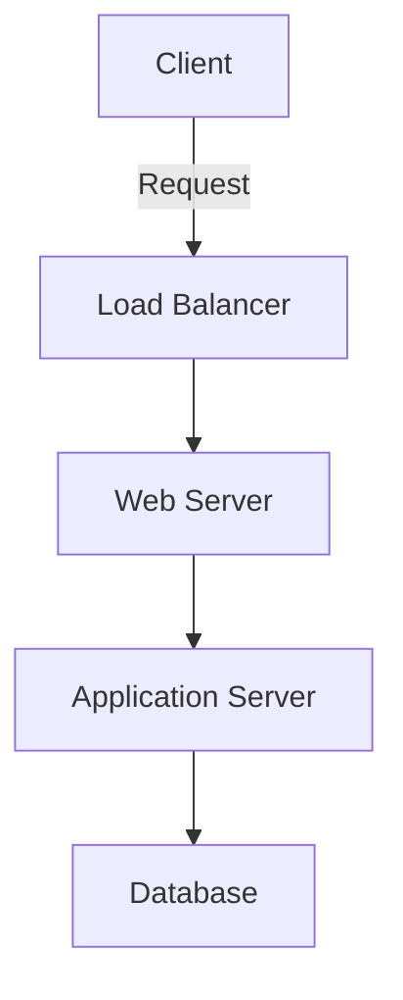

# Documentation

Technical documentation and guides for the AI-Whisperers platform.

## Overview

This repository serves as the central hub for all technical documentation, API references, tutorials, and architectural documentation for the AI-Whisperers platform.

## Structure

```
documentation/
├── getting-started/   # Onboarding and setup guides
├── api-reference/     # API documentation
├── architecture/      # System design and architecture
├── tutorials/         # How-to guides and tutorials
└── contributing/      # Contribution guidelines
```

## Quick Links

### For Developers
- [Getting Started Guide](getting-started/README.md)
- [API Reference](api-reference/README.md)
- [Development Setup](getting-started/development-setup.md)
- [Code Style Guide](contributing/code-style.md)

### For Operations
- [Deployment Guide](getting-started/deployment.md)
- [Infrastructure Overview](architecture/infrastructure.md)
- [Monitoring & Alerts](architecture/monitoring.md)
- [Troubleshooting Guide](getting-started/troubleshooting.md)

### For Product Teams
- [Feature Documentation](tutorials/features.md)
- [User Guides](tutorials/user-guides.md)
- [Integration Guides](tutorials/integrations.md)

## Documentation Standards

### File Naming
- Use kebab-case for file names: `api-authentication.md`
- Group related documents in folders
- Include README.md in each folder

### Document Structure
1. **Title** - Clear, descriptive title
2. **Overview** - Brief description of the topic
3. **Prerequisites** - Required knowledge or setup
4. **Content** - Main documentation body
5. **Examples** - Code examples and use cases
6. **Troubleshooting** - Common issues and solutions
7. **Related Links** - References to related documentation

### Markdown Guidelines
- Use proper heading hierarchy (H1 for title, H2 for sections, etc.)
- Include code blocks with language specification
- Add diagrams using Mermaid or links to images
- Use tables for structured data
- Include links to related documentation

## Writing Documentation

### Creating New Documentation

1. Choose the appropriate category folder
2. Create a new markdown file with descriptive name
3. Follow the document structure template
4. Include examples and diagrams where helpful
5. Add to the appropriate index/README file

### Document Template

```markdown
# Document Title

## Overview
Brief description of what this document covers.

## Prerequisites
- Requirement 1
- Requirement 2

## Main Content

### Section 1
Content here...

### Section 2
Content here...

## Examples

\```language
// Code example
\```

## Troubleshooting

### Common Issue 1
Solution...

### Common Issue 2
Solution...

## Related Documentation
- [Link to related doc](path/to/doc.md)
```

## API Documentation

### OpenAPI/Swagger
API documentation is auto-generated from OpenAPI specifications:

```bash
# Generate API docs
npm run generate-api-docs

# Preview API docs
npm run preview-api-docs
```

### API Documentation Structure
```
api-reference/
├── authentication.md
├── endpoints/
│   ├── users.md
│   ├── projects.md
│   └── resources.md
├── webhooks.md
├── rate-limiting.md
└── errors.md
```

## Architecture Documentation

### Diagrams
We use various tools for architecture diagrams:
- **Mermaid** - For flowcharts and sequence diagrams
- **Draw.io** - For complex architecture diagrams
- **PlantUML** - For UML diagrams

### Example Mermaid Diagram


## Tutorials and Guides

### Tutorial Structure
1. **Objective** - What will be accomplished
2. **Time Required** - Estimated completion time
3. **Difficulty** - Beginner/Intermediate/Advanced
4. **Prerequisites** - Required setup or knowledge
5. **Steps** - Numbered, detailed instructions
6. **Verification** - How to verify success
7. **Next Steps** - What to do after completion

## Contributing to Documentation

### Process
1. Fork the repository
2. Create a feature branch
3. Make your changes
4. Test documentation locally
5. Submit a pull request
6. Address review feedback

### Review Checklist
- [ ] Accurate and up-to-date information
- [ ] Clear and concise writing
- [ ] Proper formatting and structure
- [ ] Working code examples
- [ ] No broken links
- [ ] Spell check and grammar check

## Building Documentation Site

### Local Development
```bash
# Install dependencies
npm install

# Start development server
npm run dev

# Build static site
npm run build
```

### Documentation Tools
- **MkDocs** - Static site generator
- **Docusaurus** - React-based documentation
- **GitBook** - Documentation platform
- **Sphinx** - Python documentation generator

## Versioning

Documentation is versioned alongside the platform:
- `main` branch - Latest development docs
- `v1.0` branch - Version 1.0 documentation
- `v2.0` branch - Version 2.0 documentation

### Version Banners
Include version banners for outdated documentation:
```markdown
> ⚠️ **Note**: This documentation is for version 1.0. 
> For the latest version, see [current documentation](link).
```

## Search and Navigation

### Table of Contents
Each major document should include a table of contents:
```markdown
## Table of Contents
- [Section 1](#section-1)
- [Section 2](#section-2)
- [Section 3](#section-3)
```

### Search Optimization
- Use descriptive titles and headings
- Include relevant keywords
- Add metadata tags where supported
- Create comprehensive indexes

## Localization

Documentation is available in multiple languages:
- English (en) - Primary language
- Spanish (es)
- French (fr)
- German (de)
- Japanese (ja)
- Chinese (zh)

### Translation Process
1. Mark strings for translation
2. Export to translation service
3. Review translations
4. Import and verify

## Documentation Metrics

We track documentation quality and usage:
- Page views and popular topics
- Search queries and failed searches
- Time on page and bounce rate
- User feedback and ratings

## Support and Feedback

### Getting Help
- GitHub Issues for documentation bugs
- Discussions for questions
- Slack channel: #documentation

### Providing Feedback
- Use the feedback widget on documentation pages
- Submit issues for errors or improvements
- Contribute corrections via pull requests

## License

Documentation is licensed under [CC BY 4.0](LICENSE).
Code examples are licensed under [MIT License](LICENSE-CODE).